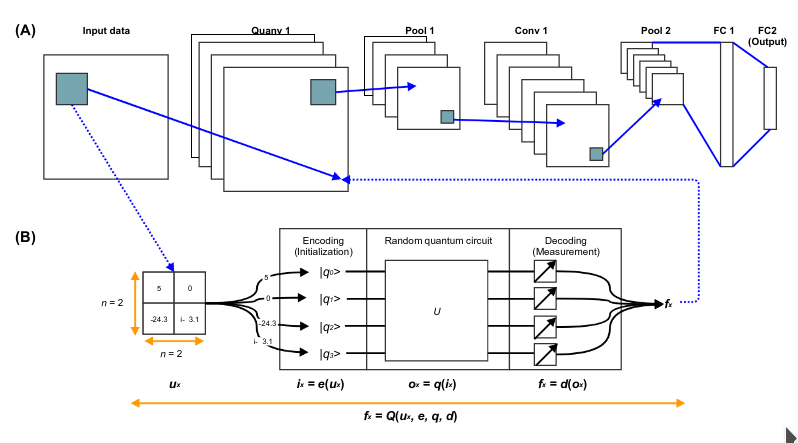

# QNNProject

## Description
The main goal of this project is trying to reproduce a concept of paper [Quanvolutional Neural Networks: Powering](https://arxiv.org/abs/1904.04767). As a framework I used [PennyLane](https://pennylane.ai/).\
Also there are some examples with [AWS Bracket](https://aws.amazon.com/ru/braket/) and [Bell State](https://en.wikipedia.org/wiki/Bell_state)

## Repository structure
**Examples.ipynb** - jupyter notebook with examples for Braket ([Bell State](https://en.wikipedia.org/wiki/Bell_state) on different machines and PennyLane (Bell State and gradient descent)\
**QNNExample.ipynb** - jupyter notebook reproduced some concepts of QNN paper\
**QNN.ipynb** - jupyter notebook with experiments for final report

## Links
[Bell State](https://en.wikipedia.org/wiki/Bell_state)\
[AWS Bracket examples](https://github.com/aws/amazon-braket-examples)\
[ODS QML Course](https://ods.ai/tracks/qmlcourse)\
[PennyLane](https://pennylane.ai/)\
[Quanvolutional paper](https://arxiv.org/abs/1904.04767)

## Idea
### Classical convolution
The convolutional neural network (CNN) is a standard model in classical machine learning which is particularly suitable for processing images. The model is based on the idea of a convolution layer where, instead of processing the full input data with a global function, a local convolution is applied.

If the input is an image, small local regions are sequentially processed with the same kernel. The results obtained for each region are usually associated to different channels of a single output pixel. The union of all the output pixels produces a new image-like object, which can be further processed by additional layers.

### Quantum Convolution
One can extend the same idea also to the context of quantum variational circuits. A possible approach is given by the following procedure which is very similar to the one used in [this paper](https://arxiv.org/abs/1904.04767). The scheme is represented below.


*A. Simple example of a quanvolutional layer in a full network stack. The quanvolutional layer contains several quanvolutional filters (three in this example) that transform the input data into different output feature maps. B. An in-depth look at
the processing of classical data into and out of the random quantum circuit in the quanvolutional filter.*

**Pipeline:**
1. A small region of the input image, in our example a 2x2 square, is embedded into a quantum circuit. This is achieved with parametrized rotations applied to the qubits initialized in the ground state.
2. A quantum computation, associated to a unitary, is performed on the system. The unitary could be generated by a variational quantum circuit or, more simply, by a random circuit.
3. The quantum system is finally measured, obtaining a list of classical expectation values. The measurement results could also be classically post-processed but, for simplicity, here we directly use the raw expectation values.
4. Analogously to a classical convolution layer, each expectation value is mapped to a different channel of a single output pixel.
5. Iterating the same procedure over different regions, one can scan the full input image, producing an output object which will be structured as a multi-channel image.
6. The quantum convolution can be followed by further quantum layers or by classical layers.

**The main difference** with respect to a classical convolution is that a quantum circuit can generate highly complex kernels whose computation could be, at least in principle, classically intractable.

### Strength of quanvolutional approach
1.Inherently hybrid algorithm. All NISQ algorithms of interest will be hybrid by nature, and the QNN framework embraces this whole-heartedly. The QNN stack purposely integrates elements from both classical data and algorithms (CNNs) with quantum subprocesses(quanvolutional layers). While inherently hybrid classicalquantum approaches will likely fall short of some of the lofty goals of quantum computing, such as exponential speedups over classical calculations, we contend that the NISQ field will show a “crawl-walk-run” evolution, where modest (polynomial) speedups and improvements will occur before larger (exponential) ones are discovered.\
2. No QRAM requirements. A major hurdle for QML speedups is the lack of an efficient way of loading large classical data into quantum random access memory (QRAM) for future operations. However, since the QNN framework approach simply requires running many quantum circuits on single data points, there is no need to store entire datasets into QRAM.\
3. Potential resiliency to unknown but consistent error models. Since quanvolutional layer feature maps result from transforming data through random quantum circuits, it is reasonable to assume that adding in particular error models does not necessarily invalidate the overall algorithm. Conceptually, many forms of quantum error can be thought of as unknown, and unwanted, gate operations. For example, the user attempts to run a particular quantum circuit, and due to hardware imperfections and limitations, some subtle and hidden “noisy quantum gates are also added into the circuit, resulting in a final quantum state different than desired. Since QNNs use the quantum circuits as feature detectors, and it is not clear a priori which quantum circuits leads to the most useful features, adding in some unknown “noise” gates does not necessarily impact feature detection quality overall.\

## Experiments
1. **CNN Model**

```
keras.layers.Conv2D(32, 5, activation="relu")
keras.layers.MaxPool2D()
keras.layers.Conv2D(64, 5, activation="relu")
keras.layers.Flatten()
keras.layers.Dense(1024, activation="relu")
keras.layers.Dropout(0.4)
keras.layers.Dense(10, activation="softmax")
```

2. **Find the best QNN hyperparameters** (Train=2500, Test=500)

|Layers|Wires|Time Processing, sec.|Accuracy|
|------|-----|---------------------|--------|
|Classic|Classic|Classic|0.964|
|1|2|6009|0.96|
|1|3|8535|0.968|
|1|4|11397|0.976|
|2|2|8588|0.96|
|2|3|11805|0.976|
|2|4|16194|0.97|
|3|2|11048|0.972|
|3|3|14004|0.966|
|3|4|20747|0.966|

3. **Test diefferent test size**

|Model Type|Train Size|Time Processing| Accuracy|
|----------|----------|---------------|---------|
|Classic|100|-|0.736|
|Qnn|100|375|0.679|
|Classic|500|-|0.8893|
|Qnn|500|1858|0.8969|
|Classic|1000|-|0.939|
|Qnn|1000|3726|0.9236|
|Classic|5000|-|0.976|
|Qnn|5000|3726|0.973|
|Classic|20000|-|0.986|
|Qnn|20000|74702|0.711|
|Classic|30000|-|0.989|
|Qnn|30000|111936|0.862|

